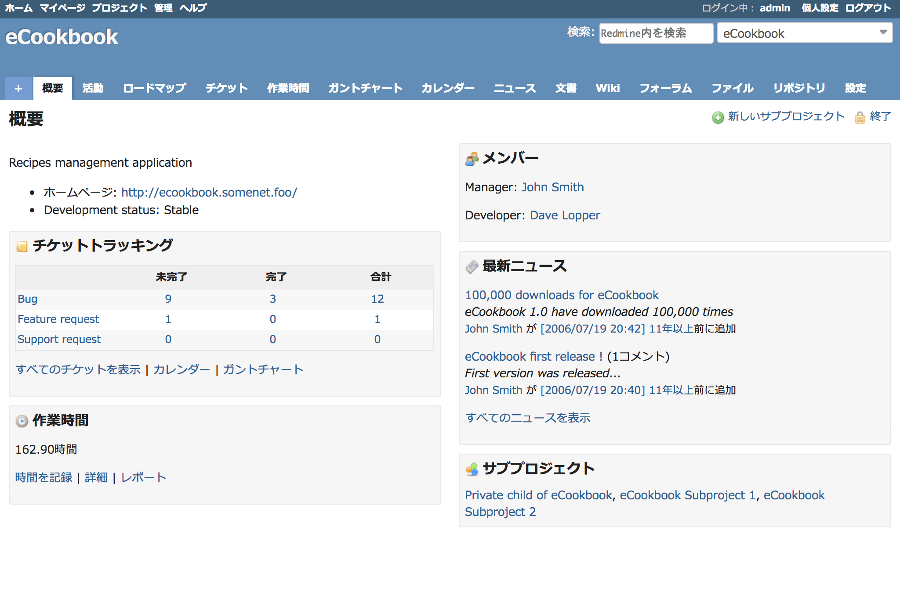
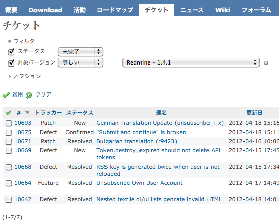
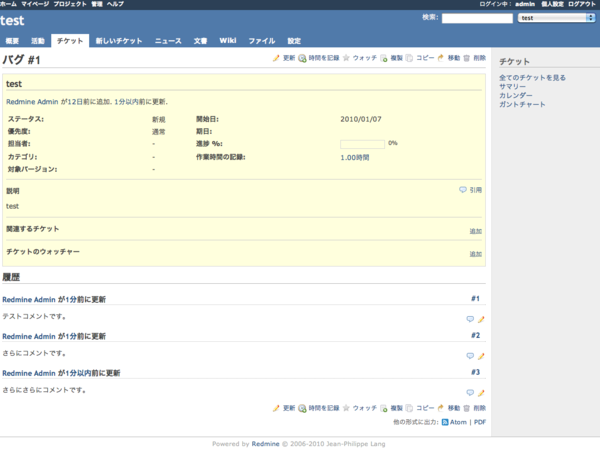
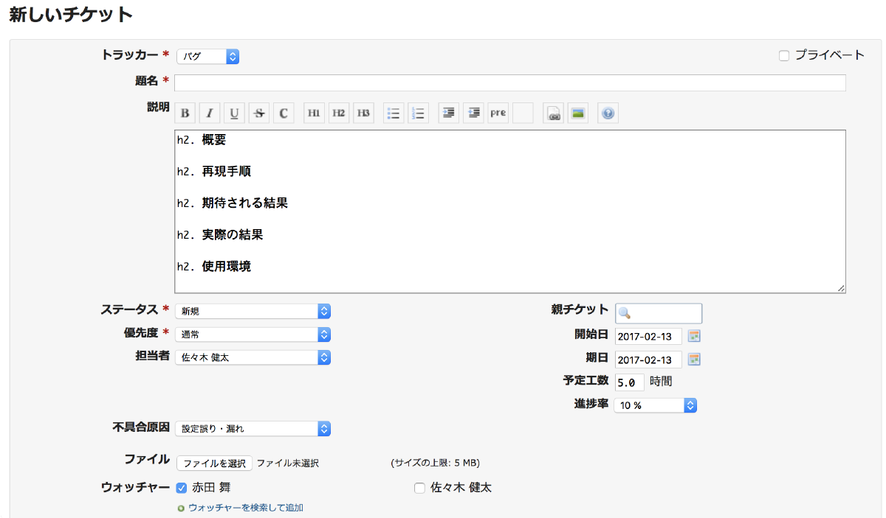
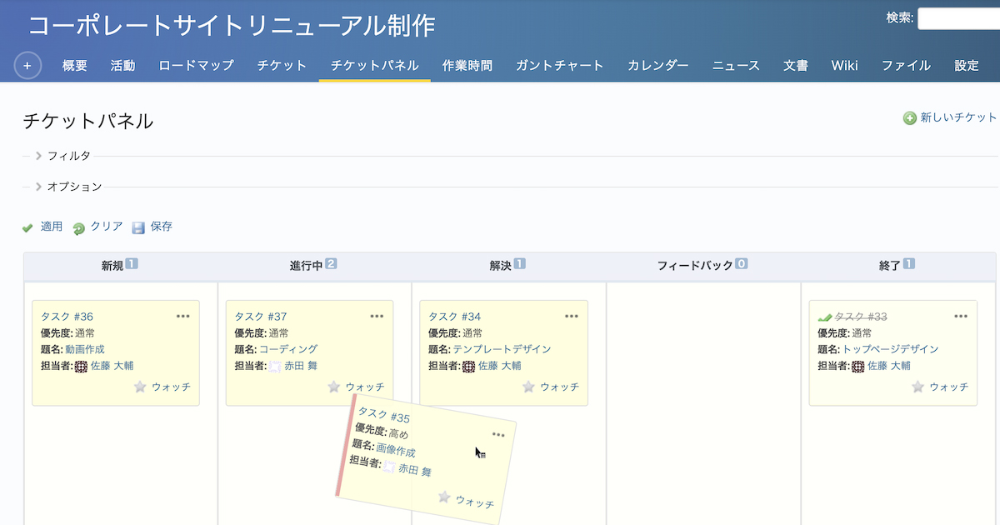
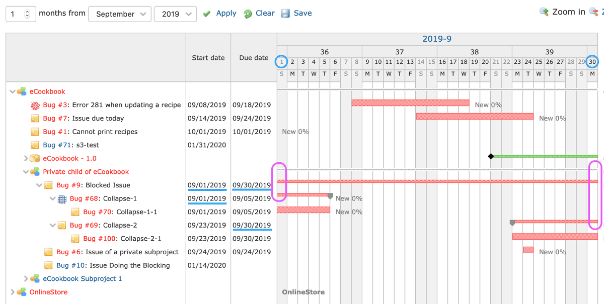
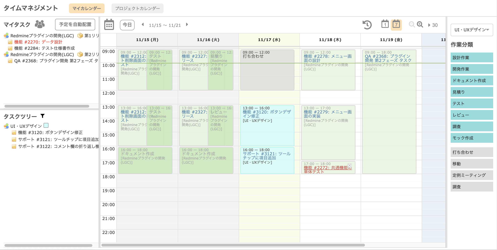

# チケット管理システム

## 画面遷移
```
Home画面
　├ チケット一覧＆検索画面 [必]
　│　└ チケット詳細画面 [必]
　│　　└ チケット更新画面 [必]
　├ チケット作成画面 [必]
　├ カンバンボード [必]
　├ ガントチャート [任]
　└ カレンダー [任]
```

## 画面機能一覧
* Home画面
1. 各画面への遷移機能



* チケット一覧画面＆検索画面
1. チケット詳細画面への遷移機能
2. 条件からチケットを検索し、対象チケットを表示する機能



* チケット詳細画面
1. チケット更新画面への遷移



* チケット作成画面
* チケット更新画面
1. 入力データをDBに反映する機能



* カンバンボード



* ガントチャート



* カレンダー




## テーブル定義

* TICKETテーブル
|項目名|物理名|型|備考|
|:-:|:-:|:-:|:-:|
|チケットID|TicketID|NUMBER|主キー(django自動)|
|タイトル|Title|VARCHAR(200)|
|分類|CategoryID|NUMBER|Categoryテーブル.ID|
|チケット説明|Description|VARCHAR(500)|
|担当者ID|workerID|NUMBER|USERテーブル.ユーザID|
|開始日付|StartDate|Date|
|終了予定日|DeadlineDate|Date|
|進捗状況|StatusID|NUMBAR|Statusテーブル.ID|

* USERテーブル（django USERテーブル拡張）
|項目名|物理名|型|
|:-:|:-:|:-:|
|ユーザID|UserID|NUMBER|
|ユーザ名|Name|VARCHAR|

* Categoryテーブル
|項目名|物理名|型|
|:-:|:-:|:-:|
|カテゴリID|CategoryID|NUMBER|
|カテゴリ名|Name|VARCHAR|

* Statusテーブル
|項目名|物理名|型|
|:-:|:-:|:-:|
|ステータスID|StatusID|NUMBER|
|ステータス名|Name|VARCHAR|
